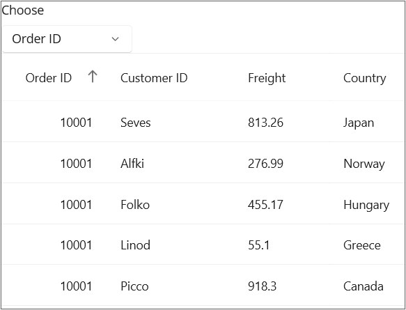

# How to sort the DataGrid columns programmatically using a picker in MAUI DataGrid
In.NET [MAUI DataGrid](https://www.syncfusion.com/maui-controls/maui-datagrid) (SfDataGrid) allows you to [DataGridColumn](https://help.syncfusion.com/cr/maui/Syncfusion.Maui.DataGrid.DataGridColumn.html) based on the user option by selecting an option in the **Picker** by handling the **SelectionIndexChanged** event of the Picker. Sorting can be performed based on the Selected Index from the picker by modifying the [SfDataGrid.SortColumnDescriptions](https://help.syncfusion.com/cr/maui/Syncfusion.Maui.DataGrid.SfDataGrid.html#Syncfusion_Maui_DataGrid_SfDataGrid_SortColumnDescriptions) collection.

Refer the below code example to add the columns to be sorted in a Picker.
## XAML
```XML
<StackLayout>
    <Picker x:Name="SelectionPicker"
            Title="Choose"
            HorizontalOptions="Start"
        SelectedIndex="0"
            SelectedIndexChanged="OnSelectionChanged"
            WidthRequest="150">
        <Picker.Items>
            <x:String>Order ID</x:String>
            <x:String>Customer ID</x:String>
            <x:String>Freight</x:String>
            <x:String>Country</x:String>
        </Picker.Items>
    </Picker>
    <syncfusion:SfDataGrid x:Name="dataGrid"
            ItemsSource="{Binding OrdersInfo}"
                        AutoGenerateColumnsMode="None"
                        VerticalOptions="FillAndExpand">
        <syncfusion:SfDataGrid.Columns>
            <syncfusion:DataGridNumericColumn MappingName="OrderID" HeaderText="Order ID" Format="d" />
            <syncfusion:DataGridTextColumn MappingName="CustomerID" HeaderText="Customer ID"/>
            <syncfusion:DataGridTextColumn MappingName="Freight"  />
            <syncfusion:DataGridTextColumn MappingName="Country"/>
        </syncfusion:SfDataGrid.Columns>
    </syncfusion:SfDataGrid>
</StackLayout>
```
### C#
```C#
public void OnSelectionChanged(object sender, EventArgs e)
{
    if (SelectionPicker.SelectedIndex == 0)
    {
        this.dataGrid.SortColumnDescriptions.Clear();
        this.dataGrid.SortColumnDescriptions.Add(new SortColumnDescription() { ColumnName = "OrderID" });
    }
    else if (SelectionPicker.SelectedIndex == 1)
    {
        this.dataGrid.SortColumnDescriptions.Clear();
        this.dataGrid.SortColumnDescriptions.Add(new SortColumnDescription() { ColumnName = "CustomerID" });
    }
    else if (SelectionPicker.SelectedIndex == 2)
    {
        this.dataGrid.SortColumnDescriptions.Clear();
        this.dataGrid.SortColumnDescriptions.Add(new SortColumnDescription() { ColumnName = "Freight" });
    }
    else if (SelectionPicker.SelectedIndex == 3)
    {
        this.dataGrid.SortColumnDescriptions.Clear();
        this.dataGrid.SortColumnDescriptions.Add(new SortColumnDescription() { ColumnName = "Country" });
    }
}
```


## Conclusion
I hope you enjoyed learning about how to sort the DataGridColumn programmatically using a picker in MAUI DataGrid (SfDataGrid).

You can refer to our [.NET MAUI DataGrid’s feature tour](https://www.syncfusion.com/maui-controls/maui-datagrid) page to know about its other groundbreaking feature representations. You can also explore our .NET MAUI DataGrid Documentation to understand how to present and manipulate data.
For current customers, you can check out our .NET MAUI components from the [License and Downloads](https://www.syncfusion.com/account/downloads) page. If you are new to Syncfusion, you can try our 30-day free trial to check out our .NET MAUI DataGrid and other .NET MAUI components.
If you have any queries or require clarifications, please let us know in comments below. You can also contact us through our [support forums](https://www.syncfusion.com/forums), [Direct-Trac](https://support.syncfusion.com/account/login?ReturnUrl=%2Faccount%2Fconnect%2Fauthorize%2Fcallback%3Fclient_id%3Dc54e52f3eb3cde0c3f20474f1bc179ed%26redirect_uri%3Dhttps%253A%252F%252Fsupport.syncfusion.com%252Fagent%252Flogincallback%26response_type%3Dcode%26scope%3Dopenid%2520profile%2520agent.api%2520integration.api%2520offline_access%2520kb.api%26state%3D8db41f98953a4d9ba40407b150ad4cf2%26code_challenge%3DvwHoT64z2h21eP_A9g7JWtr3vp3iPrvSjfh5hN5C7IE%26code_challenge_method%3DS256%26response_mode%3Dquery) or [feedback portal](https://www.syncfusion.com/feedback/maui?control=sfdatagrid). We are always happy to assist you!
